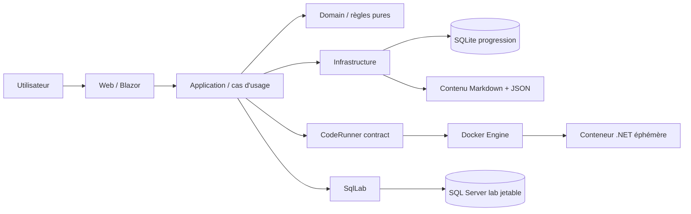
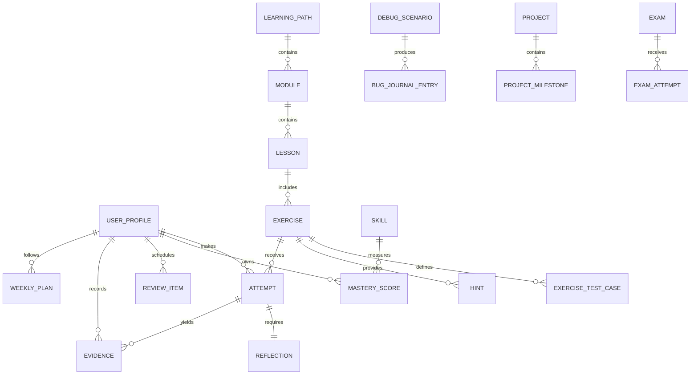
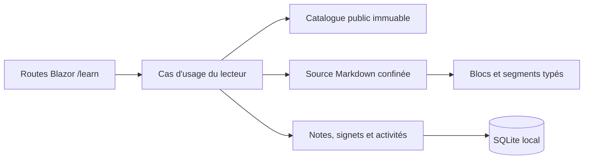
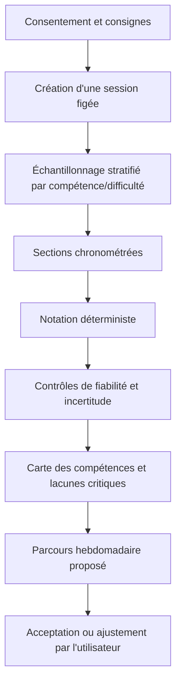
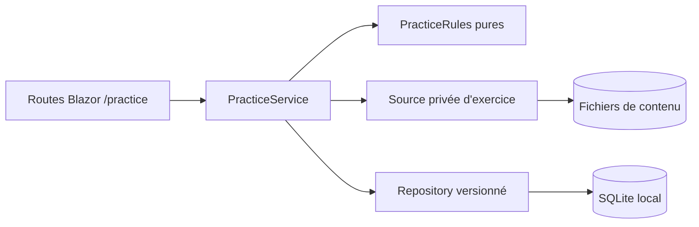

# Architecture — Forge.NET

## Style retenu et diagramme des modules

Monolithe modulaire en quatre couches applicatives et un processus d'exécution séparé. Les limites métier sont des modules logiques ; elles ne deviennent des projets que si une contrainte d'isolation ou de déploiement le justifie.



## Solution cible

```text
ForgeDotNet.sln
src/
  ForgeDotNet.Web/
  ForgeDotNet.Application/
  ForgeDotNet.Domain/
  ForgeDotNet.Infrastructure/
  ForgeDotNet.CodeRunner/
tests/
  ForgeDotNet.UnitTests/
  ForgeDotNet.IntegrationTests/
  ForgeDotNet.EndToEndTests/
content/{curriculum,exercises,debugging,sql,interviews,english,projects}/
docs/
docker-compose.yml
```

## Dépendances

```text
Web -> Application, Infrastructure (composition seulement)
Infrastructure -> Application, Domain
Application -> Domain
CodeRunner -> Application (contrats) ou contrat dédié sans dépendance Web
Domain -> aucune dépendance applicative
Tests -> projet(s) ciblé(s)
```

## Modules fonctionnels

| Module | Responsabilité | Données principales |
|---|---|---|
| IdentityLocal | Profil, préférences, contrat | UserProfile |
| Curriculum | Catalogue, lecteur, prérequis, navigation | LearningPath, Module, Lesson, LessonReadingActivity |
| Diagnostic | Banque, tirage figé, minuterie, collecte et évaluation prudente | DiagnosticSession, DiagnosticResponse, DiagnosticEvaluation |
| WeeklyPlanning | Recommandations, charge, semaines, ajustement et acceptation | WeeklyPlan |
| Practice | Exercices, réflexions, indices | Exercise, Attempt, Hint, Reflection |
| CodeRunner | Préparer et isoler une exécution | RunRequest, RunResult |
| SqlLab | Scénarios, reset, validation SQL | SqlScenario, SqlAttempt |
| DebugLab | Méthode et journal des bugs | DebugScenario, BugJournalEntry |
| Mastery | Scores, révisions, portes | MasteryScore, ReviewItem |
| Exams | Tirage, échéance, soumissions, rapport | Exam, ExamAttempt, ExamSubmission |
| Projects | Jalons et preuves | Project, ProjectMilestone, Evidence |
| Interview | Banque et simulations | InterviewQuestion |
| English | Activités professionnelles | EnglishActivity |
| Career | CV, candidatures, suivi | JobApplication |
| Analytics | Projections de lecture | agrégats calculés |

Les modules communiquent par cas d'usage explicites et événements métier en mémoire après transaction ; pas de bus distribué.

## Modèle de données minimal



Le catalogue pédagogique est chargé depuis les fichiers et référencé par identifiant/version dans SQLite. Les tentatives conservent un snapshot minimal (version, hash, résultat) pour rester auditables après évolution du contenu.

La validation v1 suit `Web (composition CLI) -> Application -> Infrastructure (fichiers) -> Domain`. Le chargement construit ensuite un `ContentCatalog` privé, résout références et graphes, puis `ContentCatalogProvider` publie le snapshot par échange atomique. Les index par ID, type et compétence sont immuables ; un rechargement refusé conserve l'instance précédente. Aucun catalogue n'est persisté dans SQLite.

## Flux du lecteur



Le catalogue décide quelles leçons sont publiées et navigables. Infrastructure lit uniquement leur manifeste et leur Markdown public, puis produit un modèle typé sans HTML arbitraire. Web rend ce modèle avec l'encodage Razor ; il ne connaît ni réponse correcte initiale, ni solution, ni test caché.

La progression de lecture est une projection pure du nombre d'activités observables distinctes : confirmation explicite d'une section ou réussite du quiz. La visite seule, une mauvaise réponse, un doublon ou un identifiant inconnu ne l'augmentent pas. Cette projection n'est pas une maîtrise.

## Flux du diagnostic



Une interruption conserve les réponses mais marque la session incomplète. Un plan issu d'un diagnostic incomplet est explicitement provisoire.

L'incrément 03A couvre la collecte. `DiagnosticSampler` sélectionne un plan public déterministe par domaine et difficulté ; ce plan est figé dans SQLite avec la version et la révision de banque. `DiagnosticTimelineRules` porte les transitions pures. Application utilise `TimeProvider` et vérifie l'échéance serveur avant chaque réponse ou transition. Web ne reçoit pas la clé attendue.

L'incrément 03B couvre notation, incertitude et carte des domaines. `DiagnosticEvaluationRules` est un calcul Domain pur : poids de difficulté et de domaine, scores 0–100, intervalle de Wilson pondéré, confiance qualitative, niveau prudent et lacunes critiques. `DiagnosticEvaluationService` refuse une session active, vérifie l'identité exacte banque/barème et orchestre une création idempotente. Infrastructure associe la clé privée au barème puis persiste uniquement le snapshot sans clé et le rapport agrégé. Web lit la projection ; il n'affiche ni correction question par question, ni recommandation.

L'incrément 03C couvre les recommandations et l'acceptation du plan. `WeeklyPlanRules` classe chaque domaine, impose les lacunes critiques, adapte une charge maximale de 15 h aux disponibilités et conserve un contrôle pour toute semaine. `FileSystemWeeklyPlanCurriculumSource` charge un curriculum de planification v1 strict, complet et sans cycle. `WeeklyPlanService` orchestre création, nouvelle version et acceptation ; Razor ne fait que présenter la projection et transmettre la version attendue. Le snapshot fige curriculum, recommandations, avertissements et répartition horaire.

Les sections sont chronométrées séparément. Une pause explicite est possible entre deux sections, mais une section démarrée garde son échéance UTC après actualisation, fermeture ou redémarrage. Les réponses sont sauvegardées par upsert et une collecte manquante reste « incomplète ». Son évaluation est marquée « preuves insuffisantes » et provisoire.

## Flux de pratique manuelle



`PracticeRules` contrôle la réflexion en six champs, son gel, la classification des tentatives, la similarité substantielle, l'ordre des quatre indices, les deux tentatives sérieuses, le délai et les travaux après solution. `PracticeService` recharge l'état courant avant chaque transition, applique le `TimeProvider` serveur et construit une projection minimale. Infrastructure confine le contenu privé et persiste quatre agrégats append-only ; Web n'accède jamais directement aux fichiers ou à EF Core.

La solution, les indices futurs et les chemins de tests cachés sont absents de la projection tant que l'état ne les autorise pas. La consultation d'une solution produit uniquement un état non maîtrisé. L'incrément 04A n'a aucune dépendance vers `ForgeDotNet.CodeRunner` et ne démarre aucun processus.

## Règles de maîtrise et de progression

Le domaine conserve des observations, puis calcule une projection. La politique v1 `forge-mastery` / `mastery-v1-20260729` est :

```text
score = 0.45 pratique autonome
      + 0.25 examen sans aide
      + 0.15 rétention espacée
      + 0.10 explication
      + 0.05 quiz
```

- Chaque composante est bornée à 0–100 ; une composante absente n'est pas remplacée par les autres.
- Une solution consultée met la tentative à zéro pour la pratique autonome de cette activité.
- Un indice applique un plafond : H1 90, H2 80, H3 70, H4 60 ; solution 0.
- Les tentatives répétées sur le même item ont un rendement décroissant ; la variété et la récence sont requises.
- Validation de module : 80 ; compétences critiques C#, débogage, SQL, API et tests : 85.
- La validation requiert au moins une preuve récente sans aide et un examen final.
- Les seuils exacts sont configurés, versionnés et testés ; aucune mutation directe du score.
- Échec ou solution : révision J+1 et J+7. Révision générale : J+1, J+3, J+7, J+14, J+30, intervalle raccourci en cas d'échec.

`MasteryRules` est un calcul Domain pur. Il refuse les preuves dupliquées, hors profil, futures, non bornées ou non typées. La variété et la preuve récente portent sur la pratique autonome vérifiée ; un quiz ne peut pas renouveler une vieille preuve. Les projections Web sont en lecture seule et détaillent chaque composante, preuve manquante et condition de porte.

Les seuils 80/85 valident respectivement un module ordinaire/critique. Les minima C# 85, débogage 80 et SQL 75 appartiennent spécifiquement à la porte A et restent distincts. Les observations de pratique, DebugLab et SqlLab sont raccordées en 07A. Depuis 07B, seule une réponse de révision diagnostique vérifiée côté serveur peut produire une preuve `SpacedRetention` ; les autoévaluations et cartes personnelles pilotent uniquement le calendrier. Depuis 07C, un item d’examen terminé et vérifié automatiquement peut produire une preuve `ExamEngine` s’il n’est pas assisté. L’accomplissement de porte exige séparément une réussite sans aide sur une durée configurée d’au moins 90 minutes ; l’examen de référence de 30 minutes ne peut pas le simuler. Aucun producteur de livrable n’est créé avant son incrément.

## Planification des révisions

`Web -> ReviewService -> IReviewSourceProvider / IReviewRepository -> SQLite`. Web soumet une réponse et la version attendue ; il ne fournit jamais score, intervalle ou preuve de maîtrise. `ReviewRules` est un calcul Domain pur alimenté par un instant UTC, un fuseau explicite et la politique versionnée `forge-reviews`. `ReviewService` obtient l’instant exclusivement du `TimeProvider` injecté.

La planification utilise le jour civil `Europe/Paris`, pas une durée fixe de 24 heures : général J+1/J+3/J+7/J+14/J+30, récupération après échec ou solution J+1/J+7/J+14/J+30. Une réussite avance, un échec repart à J+1 et une réponse tardive réancre le prochain intervalle sur le jour réel sans dette ni pénalité. Les sources sont des snapshots immuables et leur identité déterministe rend la génération idempotente ; une révision de source crée une carte distincte.

Le fournisseur Infrastructure dérive les cartes des observations C#, DebugLab et SQL, des solutions effectivement consultées et des questions diagnostiques ratées. Les rappels d’action restent autoévalués et sans effet sur la maîtrise. Une carte diagnostique à choix conserve sa réponse privée côté serveur et peut seule créer une observation `ReviewEngine` après comparaison serveur. Les tentatives sont append-only, la concurrence est protégée par version attendue et seule une empreinte de réponse entre dans l’historique. Le contrat complet figure dans `REVIEWS.md`.

## Flux des examens et du dashboard

`Web -> ExamService -> IExamBankSource / IExamRepository -> ICodeRunner ou ISqlExamRunner`. La banque fichier ne fournit à Application que les données publiques nécessaires aux items et lie chaque candidat à sa version/révision ainsi qu’à un type de soumission figé. Les items C# et EF Core sont exécutés par le CodeRunner Docker ; les items SQL sont délégués à `SqlLabExamRunner`, qui recharge l’attente privée puis utilise une session SqlLab jetable. Domain génère un tirage `sha256-rank-v1` depuis une seed serveur, fige l’échéance UTC et autorise uniquement les transitions active, terminée, abandonnée ou expirée. SQLite conserve la tentative figée, les soumissions append-only et le rapport final atomique. Pendant l’examen, seule l’empreinte de seed est publique ; la seed et les compteurs de tests sont différés jusqu’au rapport. `IExamAccessPolicy` ferme les cas d’usage Practice tant qu’une tentative non expirée est active.

`Web -> DashboardService -> IAnalyticsEvidenceSource / MasteryService / ReviewService`. Infrastructure reconstruit les preuves à partir des tables existantes ; `AnalyticsRules` calcule une projection pure et non persistée. Un intervalle ne contribue au temps actif que s’il relie deux événements du même contexte dans un délai maximal explicite de cinq minutes. Une absence de données reste nullable et aucune valeur n’est substituée. Le dashboard ne fournit aucune commande de score. Le contrat détaillé figure dans `EXAMS_DASHBOARD.md`.

## Persistance

- SQLite via EF Core pour progression, WAL activé si compatible, transactions courtes.
- Migrations explicites appliquées au démarrage uniquement en développement ; commande/documentation contrôlée en production locale.
- Sauvegarde cohérente par checkpoint puis archive versionnée contenant base et manifeste ; restauration validée sur copie avant remplacement.
- Contenu chargé au démarrage dans un catalogue immuable ; validation complète avant publication du snapshot.
- Notes, signets et activités de lecture enregistrés séparément dans SQLite avec écritures transactionnelles et activités idempotentes.
- Sessions de diagnostic avec plan public figé, échéance serveur et réponses séparées ; une évaluation agrégée immuable par session, avec barème/version/révision figés sans clé attendue.
- Plans hebdomadaires versionnés par diagnostic ; chaque ajustement conserve la version précédente et l'acceptation fige la dernière version.
- Activités de pratique uniques par profil/exercice, réflexion séparée, tentatives et indices append-only, révision de contenu figée et concurrence protégée par version attendue.
- Résultats runner C# et validations SQL réduits à des observations typées append-only sans code ni requête ; projections de maîtrise append-only avec politique figée et révision quotidienne des preuves.
- Cartes de révision avec source immuable, politique et échéance figées ; tentatives append-only, empreinte de réponse et concurrence protégée par version attendue.
- Tentatives d’examen avec blueprint et tirage figés, échéance serveur, soumissions append-only et rapport immuable finalisé atomiquement ; une seule tentative active par profil.
- Dashboard sans table d’agrégats : toutes les mesures sont recalculées depuis les preuves locales et restent indisponibles quand la source est absente.

## Stratégie du code runner

`Web -> RunExercise use case -> ICodeRunner -> DockerCodeRunner -> Docker Engine`.

Application définit `CodeRunRequest` et `CodeRunResult`, valide les fichiers et normalise les sorties. `ForgeDotNet.CodeRunner` fournit le double déterministe de 04B, le mode manuel et, depuis 04C, `DockerCodeRunner`. Web appelle `RunExercise` et présente compilation/tests séparément ; il ne choisit aucune commande et ne reçoit aucun test caché. L'historique est borné et volatil.

`DockerCodeRunner` reçoit d'une source serveur un identifiant et une définition de suite approuvés, jamais une commande. Depuis 04D, la source de fichiers exige l'identité, la version et la révision exactes de l'exercice avant de charger les cas visibles/cachés confinés. Chaque requête crée un enfant aléatoire de la racine de workspaces, y écrit un manifeste, les sources autorisées et une suite AES-GCM chiffrée, puis lance par identifiant SHA-256 complet une image .NET SDK épinglée. La clé éphémère passe seulement par stdin. Le point d'entrée fixe compile avec Roslyn hors ligne ; chaque cas s'exécute dans un sous-processus distinct qui ne reçoit ni valeur attendue ni autre cas. Les échanges utilisent des messages NDJSON structurés. Le conteneur et le workspace sont supprimés après succès, refus, timeout ou annulation ; une absence non prouvée est une erreur.

Limites mesurées : réseau `none`, utilisateur `1654:1654`, racine en lecture seule, `/workspace` en tmpfs 64 Mio, `/tmp` 16 Mio, 0,5 CPU, 512 Mio, 64 PID/threads, 256 fichiers ouverts, 25 s de compilation, 15 s globales de tests et sortie publique 64 Kio. Toutes les capabilities sont supprimées, `no-new-privileges` et `seccomp=builtin` sont imposés explicitement, aucun device/socket/secret n'est monté et le pilote de logs est `none`. La limite disque est le tmpfs : `fsize=64 Kio` empêchait CoreCLR de démarrer et a été écarté après mesure. Une concurrence globale de 1 à 4 (2 par défaut) protège la machine.

Le mode Compose reste explicitement `Manual` et ne monte jamais le socket Docker. Le mode Docker n'est sélectionnable que dans la composition locale avec un contexte, un workspace absolu et l'identifiant immuable de l'image. Les exercices C# publiés et les deux items EF Core de l’examen 4 possèdent des suites approuvées liées à leur révision exacte ; tout autre exercice sans spécification retourne `Unavailable` et propose l'export zip manuel, sans preuve automatique. Les seules assemblies additionnelles admises à la compilation des items EF sont les dépendances EF Core SQLite épinglées et publiées dans l’image.

## Stratégie SQL des laboratoires

- `Web -> SqlLabService -> ISqlLabGateway -> SqlServerLabGateway -> SQL Server Docker`. Web ne connaît aucun secret ou contrat SqlClient ; Domain porte la garde et la validation pure.
- SQL Server tourne uniquement sur un réseau Docker interne. Chaque session utilise une base et un login aléatoires ; aucun état de session ou résultat brut SqlLab n'est écrit dans SQLite. Seule une observation d’apprentissage bornée (identité/version, statut, validation, diagnostic, durée et empreinte de requête) est persistée pour 07A.
- Les commandes serveur, accès inter-base et opérations dangereuses sont refusés en profondeur par les permissions réelles, la garde additionnelle et la jetabilité. Une transaction de protection est toujours rollbackée.
- Exécution avec timeout, annulation, concurrence, lignes, colonnes et taille UTF-8 limitées. Les erreurs publiques sont expurgées et corrélées sans requête.
- Validation par métadonnées de colonnes, ensemble ordonné/non ordonné selon exercice, valeurs normalisées, tolérance numérique et effets transactionnels attendus.
- Les exercices d'index/plan utilisent une base dédiée et des assertions sur propriétés stables, jamais un coût exact fragile.

Le dataset `dbo.Orders` de 06A est un support technique unique, pas un scénario 06B. Le reset provisionne une nouvelle base avant de détruire l'ancienne et n'échange la session qu'après nettoyage réussi. La topologie, les droits et les limites sont détaillés dans `SQLLAB.md`.

L'incrément 06B reste un lot de contenu : douze manifests v1, datasets, solutions et contrats de tests sous `content/sql/`. Le harnais d'intégration provisionne une base et un login jetables par scénario en réutilisant les garanties de 06A, sans exception par identifiant dans le moteur. Les exemples EF Core sont compilés depuis `content/sql/` par le projet de tests uniquement et utilisent un `MiniErpContext` pédagogique distinct de l'Infrastructure de Forge.NET. Le contrat détaillé figure dans `SQL_EF_CONTENT.md`.

## Observabilité et erreurs

Logs structurés locaux avec identifiants de corrélation, niveau configurable et redaction. Mesures locales : latence, échecs, timeouts et saturation des runners. Aucun code soumis, secret ou réponse d'examen n'est journalisé. L'UI reçoit des messages actionnables et un identifiant de diagnostic.

## Tests

- Unitaires : évaluation diagnostique et cas limites, pratique et anti-contournement, maîtrise, portes, planification, tirage/temps d’examen, métriques honnêtes, rubriques d'explication, prérequis.
- Intégration : EF/SQLite, barème, rapport et plan figés, diagnostic vers plan accepté, contenu privé et historique de pratique, examen/reprise/finalisation concurrente, sauvegarde/restauration, runner avec doubles puis Docker marqué explicitement.
- E2E : diagnostic réduit, leçon complète, examen sans aide, verrouillage Practice et dashboard factuel.
- Sécurité : images épinglées, timeout, réseau absent, output bomb, fork bomb, tentative d'accès filesystem/secrets et nettoyage.

## Décisions d'architecture

| Décision | Choix | Compromis |
|---|---|---|
| Déploiement | monolithe local | simplicité contre scalabilité multi-utilisateur non visée |
| Contenu | fichiers versionnés | revue Git forte, migrations de schéma nécessaires |
| Progression | SQLite | facile à sauvegarder, écritures concurrentes limitées mais suffisantes |
| Runner | Docker externe | isolation raisonnable, dépendance Docker et aucune frontière parfaite |
| Évaluation | déterministe | explicable/offline, compréhension linguistique plus limitée qu'un LLM |
